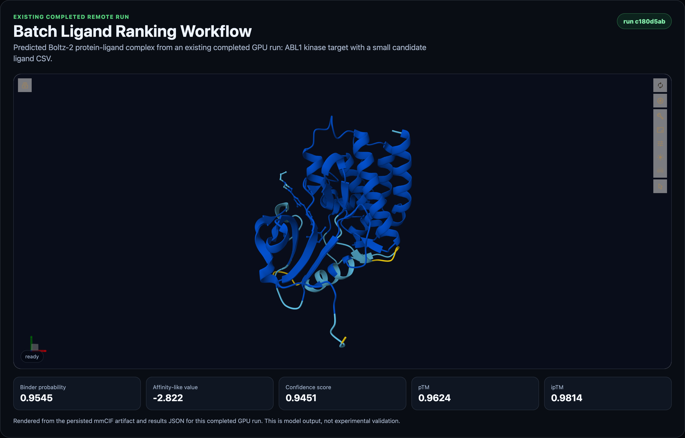
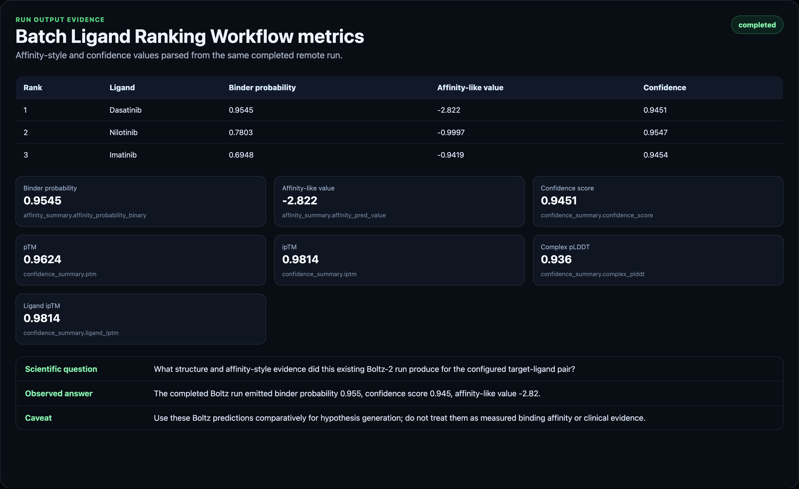

# Boltz Workflow: Batch Ligand Ranking

Batch Ligand Ranking is a guided BioSimulant Boltz workflow for comparing a small ligand CSV against one protein target. It runs Boltz-2 once per ligand, extracts binder probability, affinity-like value, confidence metrics, and top-structure artifacts, then ranks the completed candidates into a report-ready table.

This is the first workflow here that is more than a repackaged single Boltz run. It adds CSV intake, repeated execution, result aggregation, ranking, flags, and a batch-specific visualisation table. It is still designed for learning, small-set comparison, and early biological hypothesis generation, not validated drug discovery or final compound selection.

## Workflow Status

This lab validates locally, exports as a portable `.bsilab` package, and has a successful private pre-publication GPU-backed run. It is not published yet. Publication should wait for explicit approval and then the Hub workflow card can be switched from `Coming soon` to the published lab id.

Publication checklist:

- manifest validation passes: complete
- strict package export passes: complete
- entrypoints import successfully: complete
- unit tests pass: complete
- at least one real GPU run completes: complete
- run results include structure, affinity, confidence, metadata, and visuals: complete
- screenshots/assets are captured from the real run: complete
- Hub workflow card is updated with the published lab id: pending

## Pre-Publication Run Evidence

The current assets and metrics are derived from this private staged remote run:

- run id: `c180d5ab-7d17-4037-8f4a-7b28aaf35a22`
- staged lab id: `3c6200af-bc4a-4041-9714-121954af1520`
- run lab commit: `f851d8490e3b725fdb685b1b998d1e96c0f6311191bef82067d60cfdacc55c89`
- remote size: GPU A10G
- status: completed
- duration: 873.2 seconds
- credits settled: 70

Key outputs from the run:

- completed ligands: `3`
- failed ligands: `0`
- top ligand: `Dasatinib`
- top `affinity_probability_binary`: `0.954538881778717`
- top `affinity_pred_value`: `-2.822425127029419`
- top `confidence_score`: `0.945051610469818`
- top `complex_plddt`: `0.9359697103500366`
- top `ligand_iptm`: `0.981379210948944`

Ranked table evidence:

- rank 1: Dasatinib - binder probability `0.954538881778717`, affinity-like value `-2.822425127029419`, confidence `0.945051610469818`
- rank 2: Nilotinib - binder probability `0.7802920341491699`, affinity-like value `-0.9997102618217468`, confidence `0.9546635746955872`
- rank 3: Imatinib - binder probability `0.6947591304779053`, affinity-like value `-0.9419443607330322`, confidence `0.9453792572021484`

## Curated Known Example

The bundled known-example mode starts with:

- target: Human ABL1 kinase domain
- target source: RCSB PDB `2HYY` sequence FASTA
- ligand CSV examples: Imatinib, Dasatinib, and Nilotinib
- ligand sources: PubChem CID `5291`, `3062316`, and `644241`
- protein sequence length: 273 amino acids
- maximum default ligands per run: 3
- MSA server usage enabled for the default example

The example is a kinase-inhibitor teaching set. It does not predict patient response, clinical efficacy, resistance, dosing, safety, or therapeutic suitability.

## Inputs

- `protein_sequence`: amino-acid sequence for the shared target protein. If omitted, the bundled ABL1 kinase-domain example is used.
- `ligand_csv`: CSV text with `name` and `smiles` columns. Optional metadata columns are retained in the run context.
- `msa_path`: optional path to a precomputed `.a3m` MSA file.
- `run_options`: optional record for workflow/runtime options.

The known example mode works because `lab.yaml` defines the target and ligand CSV defaults directly on the batch runner model. A new user can click Run without knowing YAML, SMILES formatting details, or Boltz CLI arguments.

## Outputs

- `batch_summary`: ranked ligand rows with binder probability, affinity-like value, confidence, status, and flags.
- `structure_artifacts`: paths to the top-ranked ligand predicted complex structure files, usually mmCIF.
- `affinity_summary`: affinity-style outputs for the top-ranked completed ligand.
- `confidence_summary`: model confidence outputs for the top-ranked completed ligand.
- `run_metadata`: batch execution metadata, per-ligand statuses, output paths, captured logs, and status.

The visualisation model turns these records into standard Biosimulant run visuals, including a top-ranked structure viewer and a batch ranking table.

## Ranking Semantics

The ranking table sorts by `affinity_probability_binary` descending, then `affinity_pred_value` descending when available. This maps to Boltz-2's distinction between binder-vs-decoy probability and affinity-like prediction.

`affinity_probability_binary` is most useful as a binder-vs-decoy style signal. In product language, it is the binder probability.

`affinity_pred_value` is intended for ligand-optimization style use cases. In product language, it is an affinity-like value. It should be used cautiously and comparatively, not as a direct experimental measurement.

Flags are conservative reminders, not decisions. A row marked `review pose before follow-up` still needs expert inspection. A low-confidence row should not be promoted based only on score.

## Safe Use Cases

- Compare a small known ligand set against one target.
- Learn how Boltz-2 affinity outputs behave across ligands.
- Generate early candidate lists for deeper review.
- Prepare reproducible computational biology reports.
- Teach structure-based screening concepts.

## Do Not Claim

- Validated drug discovery.
- Clinical prediction.
- Medical diagnosis.
- Final compound selection.
- Wet-lab replacement.
- FEP replacement.
- Experimentally guaranteed binding-affinity certainty.

## Assets

The current screenshots were captured from the successful private pre-publication GPU run above, using its persisted mmCIF structure artifact, ligand-ranking output, and parsed run metrics.

## Implementation Notes

This workflow contains a batch-specific core model:

- `models/core/src/boltz2_batch_ligand_ranker.py`: CSV parsing, repeated Boltz execution, ranking, flags, top-ligand output selection.
- `models/core/src/boltz2_affinity_predictor.py`: the reused single-ligand Boltz-2 runner.
- `models/visualisation/src/docking_visualisation.py`: batch-aware top-structure and ranked-table visualisation.
