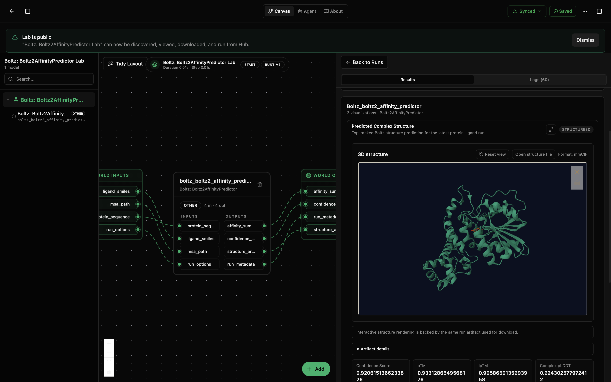
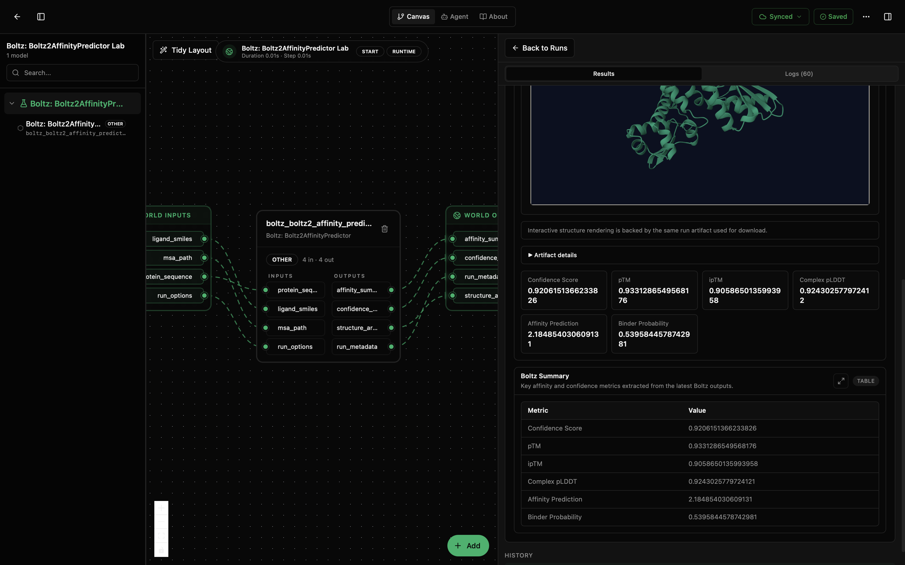

# Boltz: Boltz2AffinityPredictor Lab

This lab runs Boltz-2 to jointly predict the 3D structure of a protein-ligand complex and a binding-affinity summary from sequence-only inputs. The protein is provided as an amino-acid string and the ligand as a SMILES string. The lab ships with a real protein/ligand example baked into `lab.yaml` so a fresh run produces a renderable complex and an affinity readout without any extra setup.

The wrapper drives the upstream Boltz CLI (pinned at `boltz[cuda]==2.0.2`), runs the diffusion + recycling pipeline on a GPU runner, and returns the parsed affinity and confidence summaries plus file-backed structure artifacts (mmCIF by default).

This lab is for single-complex, sequence-only Boltz-2 affinity runs. It does not handle batch screening, custom MSAs without an MSA server, alternative Boltz model variants, or non-Boltz structural runtimes. Those belong in adjacent labs.

## What You'll See

The lab opens as a small canvas with one Boltz-2 node and a run-results panel. With the bundled defaults, the run produces:

- a structure3d view of the predicted protein-ligand complex,
- an affinity summary with binding probability and predicted affinity,
- a confidence summary with pTM, ipTM, and pLDDT bands for the top-ranked prediction,
- run metadata with the truncated Boltz stdout/stderr and the resolved output paths.

The first screenshot shows the canvas and results panel with the interactive 3D complex structure and confidence annotations. The second scrolls down to the same run's confidence, affinity, and summary-table metrics.





## How to Read the Visualizations

The structure3d view shows the predicted complex assembled from the top-ranked Boltz output. Use it to sanity-check that the ligand is positioned in a plausible binding pocket on the predicted fold. If the ligand sits outside the protein density, the prediction is unreliable for that pair regardless of what the affinity summary says.

The affinity summary reports a binding probability (dimensionless, 0 to 1) and a predicted affinity expressed as pIC50. Higher pIC50 is a stronger predicted bind. Treat both as Boltz-2 model outputs, not experimental measurements: they are useful for ranking related candidates against the same target, less useful as absolute numbers.

The confidence summary captures Boltz's internal confidence bands. pTM and ipTM track global and interface fold confidence (0 to 1, higher is better). pLDDT is per-residue confidence (0 to 100, higher is better). Low ipTM with reasonable pTM usually means the protein fold is fine but the ligand placement is uncertain.

In the screenshot run, the top-ranked prediction reports high confidence metrics for the default protein-ligand pair: confidence score about 0.92, pTM about 0.93, ipTM about 0.91, and complex pLDDT about 0.92. The affinity table reports predicted affinity about 2.18 pIC50 with binder probability about 0.54.

The run metadata records which Boltz version executed, the resolved output directory, the truncated stdout/stderr from the Boltz CLI, and `status: ok` or `status: error` so a failed run is still inspectable.

## What This Lab Contains

- `lab.yaml` describes the lab, exposes its inputs and outputs, and pins the bundled defaults.
- `wiring-layout.json` places the model on the canvas.
- `model/model.yaml` describes the model package, parameters, and ports.
- `model/src/boltz2_affinity_predictor.py` contains the wrapper, managed-runtime install logic, and visualization shaping.
- `model/tests/` checks the wrapper, manifest, and lab contract.

The bundled defaults are encoded as strings inside `lab.yaml` (`default_protein_sequence`, `default_ligand_smiles`). There is no `model/data/` directory because Boltz-2 takes sequence-only inputs.

## Inputs

The model accepts four input signals. Each one falls back to the matching `default_*` parameter in `lab.yaml` when the signal is not wired, which is what makes the lab runnable out of the box.

- `protein_sequence` (string): amino-acid sequence string. Defaults to the bundled example protein.
- `ligand_smiles` (string): SMILES string for the ligand. Defaults to the bundled example tyrosine derivative.
- `msa_path` (path, optional): path to a pre-computed MSA (.a3m). When unset and `use_msa_server: true`, Boltz queries the configured MSA server instead.
- `run_options` (record, optional): Boltz options dict merged onto the defaults. Useful for overriding `recycling_steps`, `sampling_steps`, `diffusion_samples`, `output_format`, or `accelerator` on a per-run basis without changing `lab.yaml`.

## Outputs

- `affinity_summary` (record): binding probability and predicted affinity (pIC50) for the top-ranked prediction.
- `confidence_summary` (record): pTM, ipTM, and pLDDT bands for the top-ranked prediction.
- `structure_artifacts` (record): absolute paths to the Boltz output structure files (mmCIF or PDB depending on `output_format`).
- `run_metadata` (record): runtime metadata, Boltz version, output directory, truncated stdout/stderr, and `status: ok` or `status: error`.

## Running with the Bundled Defaults

The same protein/ligand pair is also wired up as a direct local example in [`examples/boltz2-minimal/config.yaml`](../../examples/boltz2-minimal/config.yaml). To run it without the desktop app:

```bash
cd /path/to/models-boltz
python3 examples/run_example.py boltz2-minimal
```

That produces the same four BioSignal outputs as a desktop run. The first invocation installs the pinned Boltz package into a local venv (`.runtime/boltz2/`); subsequent runs reuse it. CPU mode is supported only for plumbing checks; real runs need a CUDA-capable GPU.

## Running in Biosimulant Desktop

Import the lab once with the Biosim CLI, then open it from the desktop app. The bundled defaults mean the first run requires no parameter editing.

```bash
biosimulant labs import labs/boltz-boltz2-affinity-predictor
```

To predict a different complex, override `protein_sequence` and `ligand_smiles` in the lab's run sidebar (or wire them to a source module that produces the strings). The model treats wired input signals as overrides on top of the defaults, so partial overrides work too.

## Notes

- Boltz-2 is GPU-bound. Remote runs use the GPU-enabled runtime image; local runs need a CUDA device or they will be unusably slow.
- Managed runtime mode installs `boltz[cuda]==2.0.2` on first run. Plan for a multi-minute first-run install; subsequent runs are offline.
- The bundled defaults rely on `use_msa_server: true` because no MSA file is shipped. To run fully offline, set `default_msa_path` to a local `.a3m` and toggle `use_msa_server` off.
- The lab's `runtime.duration` is intentionally short. Boltz is event-driven; the wrapper runs the prediction inside a single advance window.
