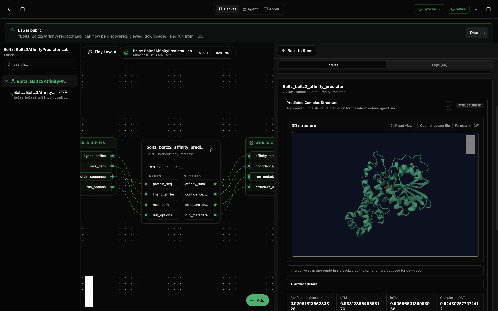
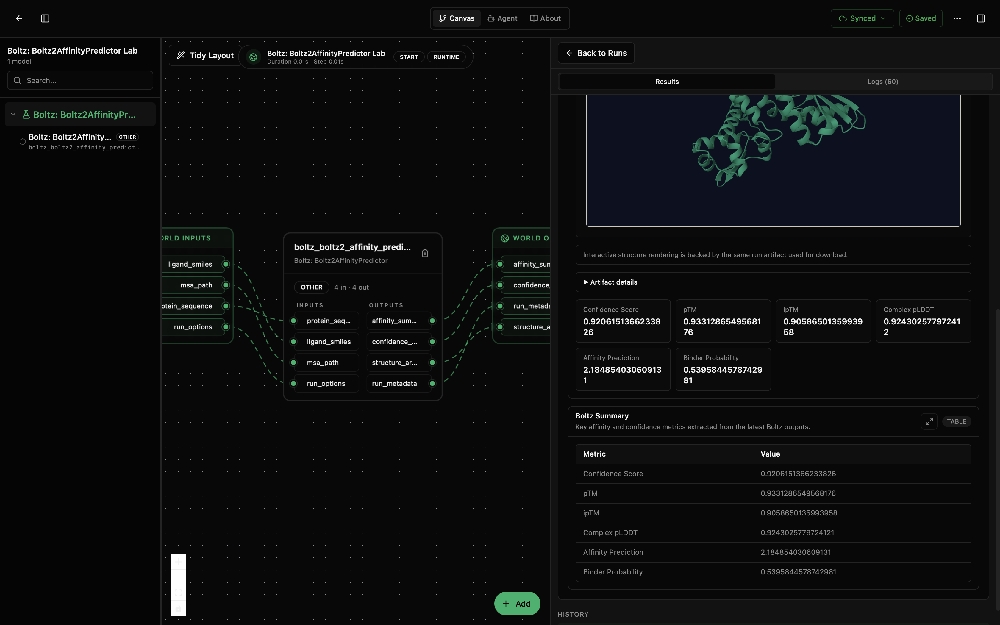

# Boltz-2 affinity predictor

This GPU Lab wraps `boltz[cuda]==2.0.2` for one protein and one ligand. It
predicts a protein-ligand complex, reports Boltz affinity outputs, and retains
the existing confidence and artifact summaries used by the visualisation.

Lab version `1.1.1` uses `biosimulant==0.0.33` and compatibility standard `0`.
It adds declared execution policies to both models and changes no ports,
profiles, parameters or scientific behaviour.
It is a new revision of the Hub `1.0.0` and `1.1.0` Labs; it does not alter those
published releases.

## Default run

The Lab includes a 384-residue protein, ligand SMILES
`N[C@@H](Cc1ccc(O)cc1)C(=O)O`, and a matching A3M file at
`models/core/assets/seq1.a3m`. The default run does not call an MSA server.

```text
use_msa_server: false
output_format: mmcif
sampling_steps: 200
recycling_steps: 3
diffusion_samples: 1
accelerator: gpu
devices: 1
```

When an A3M is used, the wrapper reads its query sequence, removes alignment
gaps, normalizes case, and checks that it equals `protein_sequence` before GPU
compute starts. If you change the protein, supply a matching A3M or explicitly
enable the MSA server.

## Inputs and compatibility

| Input | Profile | Notes |
|---|---|---|
| `protein_sequence` | `protein.sequence/v1` | One amino-acid sequence; defaults to the packaged example |
| `ligand_smiles` | `chemical.smiles/v1` | One molecular SMILES string; defaults to the packaged example |
| `msa_path` | `protein.multiple-sequence-alignment/v1` | Path to one A3M file; defaults to the packaged matching alignment |
| `run_options` | Unstandardized | Operational overrides such as sampling settings |

Lab `1.1.1` accepts mmCIF output only. A `pdb` runtime override is rejected
before Boltz runs because the public `predicted_structure` contract is mmCIF.

## Outputs and compatibility

| Output | Profile | Meaning |
|---|---|---|
| `binding_probability` | `boltz.binding-probability/v1` | Atomic `affinity_probability_binary`, finite and from 0 through 1 |
| `affinity_log10_ic50_micromolar` | `boltz.log10-ic50-micromolar/v1` | Atomic `affinity_pred_value` |
| `predicted_structure` | `protein-ligand.complex-structure-mmcif/v1` | Absolute path to the top-ranked mmCIF complex |
| `affinity_summary` | Unstandardized | Original multi-field Boltz affinity record |
| `confidence_summary` | Unstandardized | Original Boltz confidence record |
| `structure_artifacts` | Unstandardized | Operational collection of artifact paths |
| `run_metadata` | Unstandardized | Status, command, logs, cache details, versions, and compatibility provenance |

Another model may consume a Boltz output without declaring a profile when its
ordinary port structure accepts the value. Biosimulant allows that connection
with `PROFILE_PARTIAL`, meaning the consumer's scientific interpretation is not
verified. A consumer that intentionally accepts the exact Boltz-defined value
may declare the matching `boltz.*` profile; the prefix describes the value and
does not restrict which models may consume it.

Boltz defines `affinity_pred_value` as `log10(IC50)` where IC50 is expressed in
micromolar. Lower values imply stronger predicted affinity. It is not pIC50,
not an experimentally measured IC50, and not safely comparable with another
concentration basis or logarithmic convention without an explicit adapter.

Missing optional affinity fields are recorded as warnings and are not converted
to zero. A failed run emits `run_metadata.status: error` and does not emit fake
atomic values or an empty structure path. A missing required structure makes
the run fail.

## Scientific limits

All affinity, probability, confidence, and structure values are model
predictions. Compatibility checks establish representation and interface
meaning; they do not establish molecular identity, MSA quality, binding,
structural accuracy, experimental validity, or clinical usefulness.

## Validate locally

From the repository root:

```bash
biosimulant compatibility validate \
  labs/boltz-boltz2-affinity-predictor/models/core/model.yaml

biosimulant labs release validate biosimulant-packages.yaml
biosimulant labs release build biosimulant-packages.yaml \
  --out dist/biosimulant-packages
```

The full scientific run requires one CUDA GPU and can take long enough that the
managed-run timeout is set to 3600 seconds. Local unit tests mock the Boltz CLI;
the final acceptance run uses managed GPU compute and verifies the returned
atomic outputs, mmCIF artifact, logs, and Experiment Passport.

The two existing screenshots show the original visualisation, which continues
to consume the four aggregate records:




