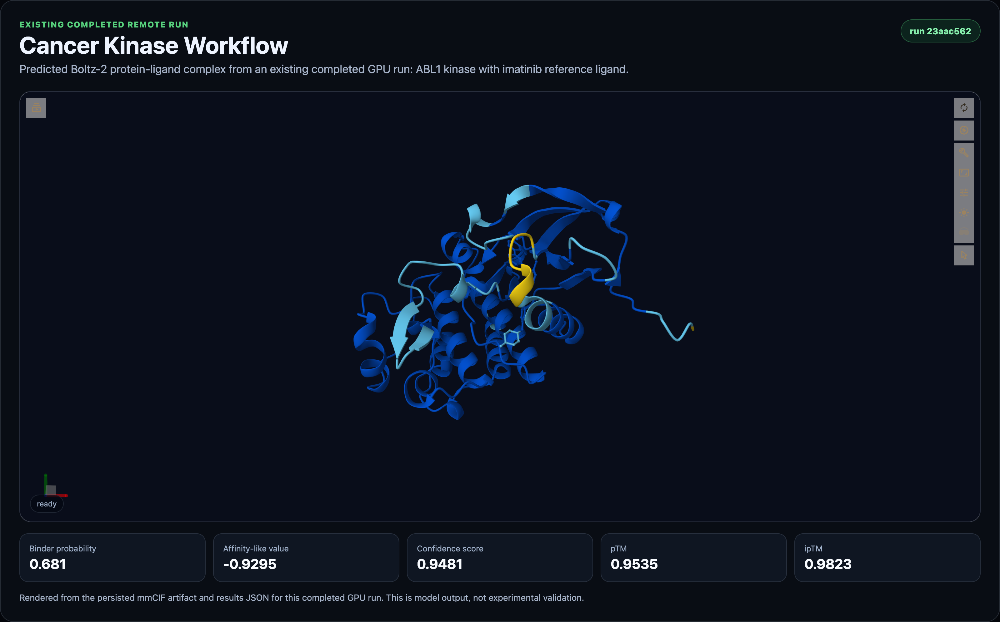
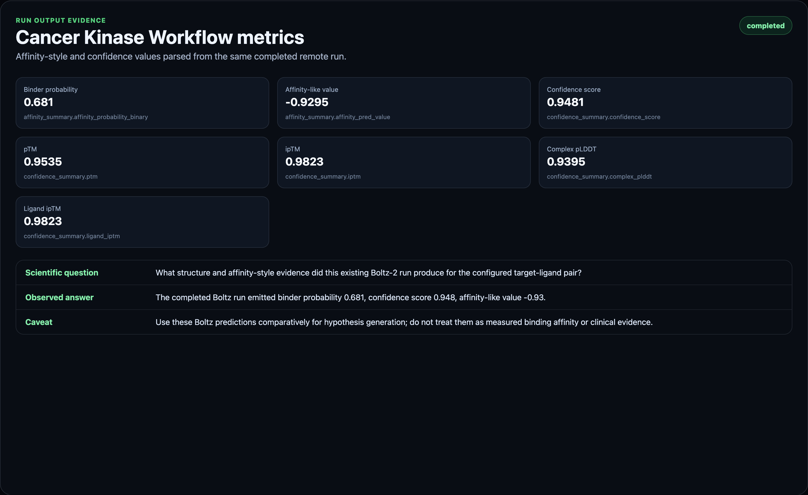

# Boltz Workflow: Cancer Kinase

Cancer Kinase Workflow is a curated Biosimulant Boltz workflow. It runs a single curated target sequence and a single reference ligand SMILES through Boltz-2, then presents the predicted complex, binder probability, affinity-like value, confidence metrics, run metadata, and report-ready caveats in the standard Biosimulant lab interface.

The workflow is designed for learning, comparison against known examples, and early biological hypothesis generation. It is not experimental validation, a clinical prediction, or a replacement for docking review, MD/FEP, assay design, or wet-lab confirmation.

## Execution behavior

Every graph component implements `BioModule.execute()` with
`ExecutionPolicy.ONCE_BEFORE_RUN`. BioWorld invokes each component once per
run and drains the dependency graph in stable layers; no artificial settle turn
is required to move data between these components. Existing temporal manifest
fields remain unchanged for compatibility with current Biosimulant products.

## Workflow Status

This lab validates locally, exports as a portable `.bsilab` package, and has a successful private pre-publication GPU-backed run. It is published on Biosimulant Hub and now uses a multi-stage Compose graph. The graph separates source-backed context, input assembly, Boltz-2 prediction, conservative interpretation, and visual reporting.

Publication checklist:

- manifest validation passes: complete
- strict package export passes: complete
- entrypoints import successfully: complete
- unit tests pass: complete
- at least one real GPU run completes: complete
- run results include structure, affinity, confidence, metadata, and visuals: complete
- screenshots/assets are captured from the real run: complete
- Hub workflow card is public and points at the published lab id: complete

## Pre-Publication Run Evidence

The current assets and metrics are derived from this private staged remote run:

- run id: `23aac562-e7c5-457c-8d95-475b083f36a6`
- staged lab id: `5e1cde99-1157-434b-9562-d2201c1d35cd`
- run lab commit: `96d24dec5798ed7b2d65709b7784313b028d87637e7fa9158aa3d6aeb705a3cf`
- remote size: GPU A10G
- status: completed
- duration: 510.7 seconds
- credits settled: 45

Key outputs from the run:

- `affinity_probability_binary`: `0.6809754967689514`
- `affinity_pred_value`: `-0.929539680480957`
- `confidence_score`: `0.9480825662612916`
- `complex_plddt`: `0.939540147781372`
- `iptm`: `0.9822518825531006`
- `ligand_iptm`: `0.9822518825531006`

## Curated Known Example

The bundled known-example mode starts with:

- target: Human ABL1 kinase domain
- target source: RCSB PDB `2HYY` sequence FASTA
- ligand: Imatinib reference kinase inhibitor
- ligand source: PubChem CID `5291`
- protein sequence length: 273 amino acids
- MSA server usage enabled for the default example

The workflow is for kinase modeling literacy and early candidate comparison; it does not predict patient response or clinical efficacy.

## What This Workflow Does

When run, the workflow:

1. Builds a Boltz-2 request from the curated or user-supplied protein and ligand inputs.
2. Runs the Boltz-2 CLI on a GPU-backed runtime.
3. Parses the top-ranked structure artifact.
4. Parses Boltz-2 affinity and confidence summaries.
5. Emits Biosimulant visuals and report-ready outputs.

<!-- BIOSIMULANT_WORKFLOW_GRAPH_START -->
## Compose Workflow Graph

The published workflow is intentionally split into real Biosimulant modules:

1. `cancer_kinase_context` emits source-backed target, ligand, disease/use-case, provenance, and caveat context.
2. `abl1_imatinib_setup` resolves the public protein, ligand, MSA, and run-option inputs into the exact Boltz request.
3. `boltz_boltz2_affinity_predictor` runs the unchanged Boltz-2 scientific wrapper.
4. `kinase_prediction_interpreter` converts raw Boltz outputs into conservative evidence fields without adding new biological claims.
5. `visualisation` renders the 3D structure, confidence/affinity summaries, source context, request traceability, and Q/A caveat cards.

This makes the Compose view match the workflow promise while keeping Boltz-2 as the only predictive scientific model. The surrounding modules are provenance, request assembly, interpretation, and presentation stages.

<!-- BIOSIMULANT_WORKFLOW_GRAPH_END -->

## Inputs

- `protein_sequence`: amino-acid sequence for the target protein. If omitted, the bundled known example is used.
- `ligand_smiles`: SMILES string for the ligand. If omitted, the bundled known example ligand is used.
- `msa_path`: optional path to a precomputed `.a3m` MSA file.
- `run_options`: optional record for workflow/runtime options.

The known example mode works because `lab.yaml` defines defaults directly on the Boltz runner model. A new user can click Run without knowing YAML, SMILES formatting details, or Boltz CLI arguments.

## Outputs

- `structure_artifacts`: paths to the predicted complex structure files, usually mmCIF.
- `affinity_summary`: affinity-style outputs parsed from Boltz-2.
- `confidence_summary`: model confidence outputs for the top-ranked prediction.
- `run_metadata`: execution metadata, output paths, captured logs, and status.

The visualisation model turns these records into standard Biosimulant run visuals, including a structure viewer and summary metrics.

## Reading The Affinity Outputs

Boltz-2 distinguishes two affinity-oriented outputs that should not be collapsed into one meaning.

`affinity_probability_binary` is most useful as a binder-vs-decoy style signal. In product language, it is the binder probability. It is useful when comparing likely binders against unlikely binders under a hit-discovery framing.

`affinity_pred_value` is intended for ligand-optimization style use cases. In product language, it is an affinity-like value. It should be used cautiously and comparatively, not as a direct experimental measurement.

Both outputs are model predictions. They can help rank hypotheses for follow-up, but they do not prove binding, potency, selectivity, mechanism, or biological effect.

## Reading The Structure

The structure viewer shows the predicted protein-ligand complex from the top-ranked Boltz output. Use it as a sanity check:

- Is the ligand near a plausible pocket?
- Is the interface confidence reasonable?
- Does the pose look inconsistent with the score?
- Are there warnings in run metadata?

A high binder probability with an implausible pose should be treated as suspicious. A plausible pose with weak confidence should also be treated as uncertain.

## Safe Use Cases

This workflow is best for kinase inhibitor teaching examples, known-inhibitor comparison, and startup-style exploration without clinical claims.

Safe uses include:

- Learn protein-ligand modeling workflows.
- Compare known ligand examples.
- Generate early hypotheses.
- Prepare candidate lists for deeper review.
- Create reproducible computational biology reports.
- Teach structure-based drug-discovery concepts.

## Do Not Claim

- Validated drug discovery.
- Clinical prediction.
- Medical diagnosis.
- Final compound selection.
- Wet-lab replacement.
- FEP replacement.
- Experimentally guaranteed binding-affinity certainty.

## Assets

The current screenshots were captured from the successful private pre-publication GPU run above, using its persisted mmCIF structure artifact and parsed run metrics.

## Implementation Notes

This workflow intentionally reuses the existing Boltz-2 affinity predictor and visualisation modules. The product difference is in the lab packaging:

- guided disease or target context
- workflow tags
- known example defaults
- safe input names
- report-oriented caveats
- future Hub placement in the Boltz Workflows section
