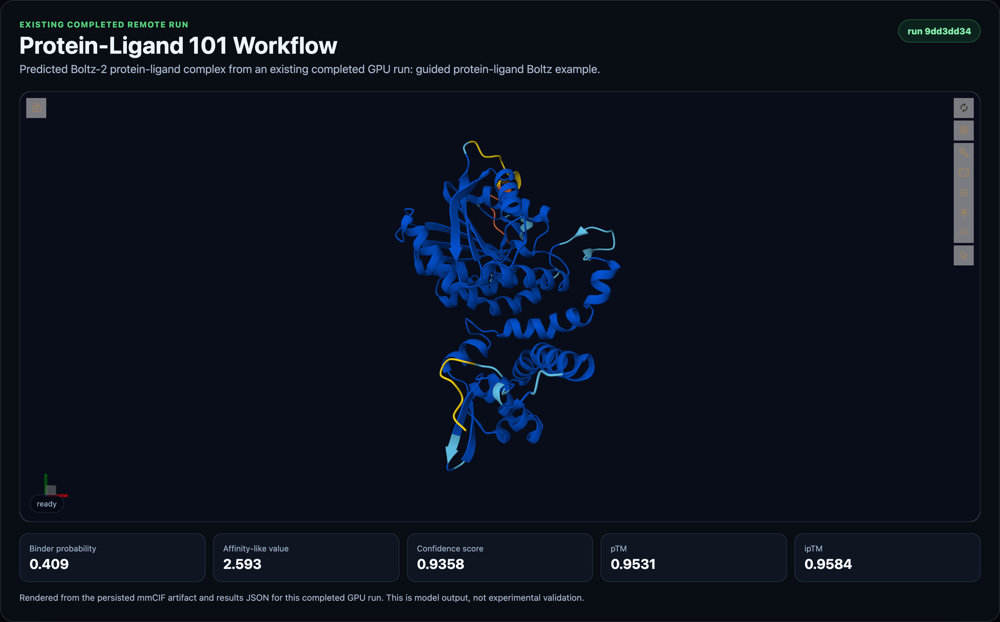
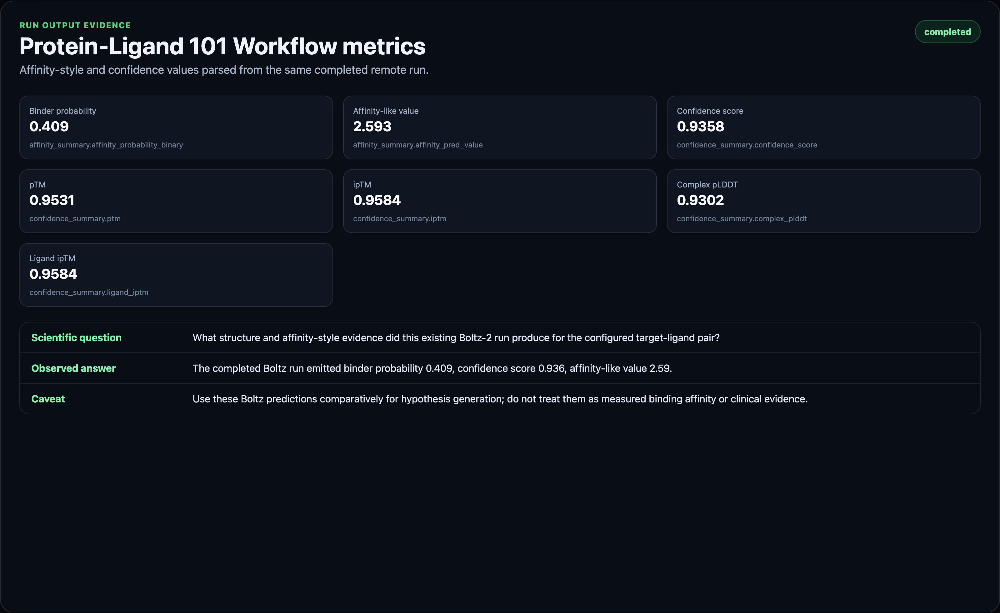

# Boltz Workflow: Protein-Ligand 101

Protein-Ligand 101 is the first curated BioSimulant Boltz workflow. It runs a single protein sequence and a single ligand SMILES through Boltz-2, then presents the predicted complex, affinity-style outputs, confidence metrics, run metadata, and report-ready caveats in the standard Biosimulant lab interface.

The workflow is designed for learning and early biological hypothesis generation. It is not experimental validation, a clinical prediction, or a replacement for docking review, MD/FEP, assay design, or wet-lab confirmation.

## Workflow Status

This lab validates locally, exports as a portable `.bsilab` package, and has a successful pre-publication GPU-backed run. It is not published yet. Publication should wait for explicit approval and then the Hub workflow card can be switched from `Coming soon` to the published lab id.

Publication checklist:

- manifest validation passes: complete
- strict package export passes: complete
- entrypoints import successfully: complete
- unit tests pass: complete
- at least one real GPU run completes: complete
- run results include structure, affinity, confidence, and metadata outputs: complete
- screenshots/assets are captured from the real run: complete
- Hub workflow card is updated with the published lab id: pending

## Pre-Publication Run Evidence

The current assets and metrics are derived from this private staged remote run:

- run id: `9dd3dd34-97ba-42b9-8009-afdb61ef1d52`
- staged lab id: `60f6f549-0987-4862-9981-d2e84e6b98d3`
- staged lab commit: `59bc08432c3058c8e370bc8f5053f7ac255fad55d6325b2f9a0b67360169c561`
- remote size: GPU A10G
- status: completed
- duration: 496.8 seconds
- credits settled: 45

Key outputs from the run:

- `affinity_probability_binary`: `0.4089837670326233`
- `affinity_pred_value`: `2.592836618423462`
- `confidence_score`: `0.9358484148979187`
- `complex_plddt`: `0.9302065968513489`
- `iptm`: `0.9584157466888428`
- `ligand_iptm`: `0.9584157466888428`

The first staged run completed but exposed an artifact persistence warning because the model emitted the raw remote `prediction_dir` path. The workflow copy of the runner was updated to emit `prediction_dir_name` instead, and the second staged run completed without that warning.

## What This Workflow Does

The bundled example starts with:

- a protein amino-acid sequence embedded in `lab.yaml`
- a ligand SMILES string embedded in `lab.yaml`
- Boltz-2 run options suitable for a small guided workflow example
- MSA server usage enabled for the default example

When run, the workflow:

1. Builds a Boltz-2 request from the protein and ligand inputs.
2. Runs the Boltz-2 CLI on a GPU-backed runtime.
3. Parses the top-ranked structure artifact.
4. Parses affinity and confidence summaries.
5. Emits Biosimulant visuals and report-ready outputs.

## Inputs

- `protein_sequence`: amino-acid sequence for the target protein. If omitted, the bundled known example is used.
- `ligand_smiles`: SMILES string for the ligand. If omitted, the bundled known example ligand is used.
- `msa_path`: optional path to a precomputed `.a3m` MSA file.
- `run_options`: optional record for workflow/runtime options.

The known example mode works because `lab.yaml` defines defaults directly on the Boltz runner model. A new user can click Run without knowing YAML, SMILES formatting details, or Boltz CLI arguments.

## Outputs

- `structure_artifacts`: paths to the predicted complex structure files, usually mmCIF.
- `affinity_summary`: affinity-style outputs parsed from Boltz-2.
- `confidence_summary`: model confidence outputs for the top-ranked prediction.
- `run_metadata`: execution metadata, output paths, captured logs, and status.

The visualisation model turns these records into the standard Biosimulant run visuals, including a structure viewer and summary metrics.

## Reading The Affinity Outputs

Boltz-2 distinguishes two affinity-oriented outputs that should not be collapsed into one meaning.

`affinity_probability_binary` is most useful as a binder-vs-decoy style signal. In product language, it is the binder probability. It is useful when comparing likely binders against unlikely binders under a hit-discovery framing.

`affinity_pred_value` is intended for ligand-optimization style use cases. In product language, it is an affinity-like value. It should be used cautiously and comparatively, not as a direct experimental measurement.

Both outputs are model predictions. They can help rank hypotheses for follow-up, but they do not prove binding, potency, selectivity, mechanism, or biological effect.

## Reading The Structure

The structure viewer shows the predicted protein-ligand complex from the top-ranked Boltz output. Use it as a sanity check:

- Is the ligand near a plausible pocket?
- Is the interface confidence reasonable?
- Does the pose look inconsistent with the score?
- Are there warnings in run metadata?

A high binder probability with an implausible pose should be treated as suspicious. A plausible pose with weak confidence should also be treated as uncertain.

## Safe Use Cases

- Learn protein-ligand modeling workflows.
- Compare known ligand examples.
- Generate early hypotheses.
- Prepare candidate lists for deeper review.
- Create reproducible computational biology reports.
- Teach structure-based drug-discovery concepts.

## Do Not Claim

- Validated drug discovery.
- Clinical prediction.
- Medical diagnosis.
- Final compound selection.
- Wet-lab replacement.
- FEP replacement.
- Experimentally guaranteed binding-affinity certainty.

## Assets

The current screenshots were captured from the successful pre-publication GPU run above, using its persisted mmCIF structure artifact and parsed run metrics.

## Implementation Notes

This workflow intentionally reuses the existing Boltz-2 affinity predictor and visualisation modules. The product difference is in the lab packaging:

- guided title and README
- workflow tags
- known example defaults
- safe input names
- report-oriented caveats
- future Hub placement in the Boltz Workflows section

Batch ligand ranking should be implemented as a separate workflow rather than overloading this lab.
